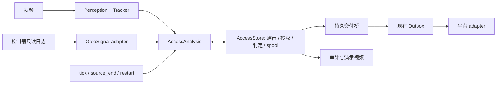

# 车辆闯道闸与人员闯门禁：联动设计 v1

状态：设计已落盘，运行模块、控制器接入和联动演示待实现。2026-09-23。

目标是复用现有检测、跟踪与持久告警交付，同时新增“完整通行 + 授权核对”。车辆与人员共用联动机制，分别维护类别、计数和通道政策。当前 `gate-02.toml` 是人员禁区配置，不是道闸模型；现有 `scene_video` 只支持 intrusion/parking。本文的接口、配置和事件类型均为待实现设计，不是可用 CLI 的参数说明。

对应规格：[车辆闯道闸](../event-specs/vehicle-gate-v1.md)、[人员闯门禁](../event-specs/pedestrian-access-v1.md)。所有模块完工须同时交付可播放视频，见 [演示验收](../demos/DELIVERY.md)。

## 1. 冻结的判定边界

- 门开、抬杆、刷卡尝试、识别到车辆或人员，均不能单独证明通行获准。
- 先确认完整穿越，再核对通道、方向、有效时间、类别和授权额度。只有权威日志覆盖完整、时钟可信、匹配无歧义、政策要求授权，才能确认未经授权通行。
- 没有控制器数据时可以展示穿越、方向、间隔等视觉事实；要求授权或需实时控制器模式确认时，授权结论必须为 `uncertain`。可由可信静态政策确定的自由通行仍可为 `not_required`。缺日志不是“未刷卡”的证据。
- 尾随是未经授权通行的一个原因；短间距不是尾随的充分条件。同一次通行只生成一个异常事件，多个原因共享 `passageId`。
- 轨迹不是身份；初版不新增人脸识别、车牌识别、人员姓名推断或闸门执行器控制。
- 画面模型分数、穿越证据质量、授权日志完整性分别保存，不能混成“违法概率”。

## 2. 通行与授权是两条状态线

每个通道标定 A 侧等待区、过渡区、B 侧完成区和有效方向。几何采用现有归一化坐标、原图检测框及底部中心参考点；参考点通过不代表整车尾部清空。两侧稳定观测与滞回用于抑制线上抖动，阈值必须用现场录像校准。

通行状态：`approaching → crossing → completed / aborted / unknown`。开始时已在门中、跨线期间断流、不可恢复的遮挡和轨迹交换，不补猜起终点。完整穿越后再反向完整返回是第二次通行；完成之前退回仍属原 episode，不能因多次压线重复计数。

授权核对在通行完成后可以暂时保持 `pending`，这是持久 episode 的处理状态，不是最终 outcome；pending 不生成缺少 outcome 的最终 PassageAssessment。水位覆盖或等待截止后形成以下结论：

| outcome | 含义 | 对外确定异常事件 |
| --- | --- | --- |
| `authorized` | 满足方向/模式政策和必要关联条件，有适用的有效容量覆盖本次通行；不等于识别了持卡人身份 | 否 |
| `not_required` | 可信现场政策在该时段、方向允许自由通行 | 否 |
| `unauthorized` | 完整可信穿越，在完整可信授权记录和政策下无适用授权/容量，或违反可信且无有效例外的禁止方向政策 | 是 |
| `uncertain` | 穿越、计数、时钟、政策、授权覆盖或关联存在无法消除的缺口 | 否；留可复核记录 |

允许确定“通道总容量不足”而无法确定具体违规者。此时记录通道级差额和候选通行集合，个人通行 outcome 不强行改成 unauthorized；第一版只生成复核记录，不能把第二个 tracker ID 当成违规者。若将来需要通道级告警，须另定事件类型与验收。

方向政策明确区分需授权、自由通行、禁止通行；普通 grant 不覆盖禁止方向。可信临时豁免须明确方向和生效范围，冲突无法解释则 uncertain。容量型政策允许证明整个无歧义通行组被适用额度覆盖，不必伪造逐人身份；账本须持久保存组占用以防再次分配。对象绑定型政策无法确定匹配时，即使总数足够也为 uncertain。

`aborted/unknown` 同样落终结记录，例如 outcome=uncertain、passageState=aborted、reason=no_completed_passage；它表示没有完整通行结论，不表示已知退回动作本身未知。先前按协议消费的 slot 独立保存，不因缺少 completed 状态而丢失。

## 3. 模块边界

拟新增 `contracts/access.py`、`core/access_analysis.py`、`core/access_store.py`、`adapters/gate_signals.py`、`apps/access_replay.py`。外部入口保持小接口：`AccessAnalysis.advance(AccessInput) -> AccessResult`。计时、控制器消息和源结束是独立输入，不能伪造成检测帧。穿越状态机、有限窗口匹配、容量分配和重复消息处理封装于模块内部。

现有 `EventAnalysis` 的人员区域停留规则继续服务入侵，`ParkingAnalysis` 继续服务驻留；快速穿门不沿用“停留 2 秒才开始”的入侵规则。SDK 原始类型只存在于 adapter 中。

## 4. 输入与审计契约草案

所有时间使用 UTC，并保存设备原始时间、接收时间及校准依据；回放采用明确的相对原点。字段集合由实现时的严格版本化契约校验，未知版本拒绝或隔离，不能静默接受。

| 契约 | 必要字段及约束 |
| --- | --- |
| `GateSignal` | schemaVersion、signalId、gateId、laneId、controllerId、controllerEpoch、sequence、kind、occurredAt、receivedAt、payload、clockQuality。来源去重键为控制器 + 周期 + 序号；同键异载荷必须报冲突。signalId 稳定，跨重发不改变。 |
| 授权 payload | grantId、方向、有效区间、允许类别、capacity、消费规则版本、可选不透明对象引用；完整授权键包含 controllerId/controllerEpoch/grantId。刷卡尝试和认证成功不自动转为授权。 |
| 撤销 payload | 引用完整授权键、effectiveAt、reason；先到撤销先持久保存，不能因尚无授权而丢弃。 |
| 状态/模式 payload | barrierState=open/closed/moving/unknown；或 operatingMode 及方向/时间/策略版本。状态来源、新鲜度与冲突独立保存。 |
| 完整性 payload | 可信序列覆盖、水位、心跳、校准版本/误差。普通心跳只能说明在线，不能自动证明此前授权日志没有缺失。 |
| `PassageAssessment` | schemaVersion、passageId、assessmentRevision、cameraId/sourceEpoch、gateId/laneId、轨迹集合与关联依据、穿越起终时间区间/方向/状态、outcome、reasonCodes、授权候选/消费 slot、所用信号键、时钟/完整性快照、模型/政策/标定版本、判定时刻、closureReason、关联 eventId/revision。每版不可变。 |
| `AccessResult` | 本次持久提交的 assessment 引用、待交付事件引用、健康状态和覆盖缺口；提交失败不得返回“已交付”。 |

授权号与通行凭证仅保留必要的不透明引用，不在演示或应用日志显示原始卡号、token 等。拒绝消息只证明该次请求被拒绝；若请求不能无歧义关联本次通行，仍需核对其他授权，不能据一条拒绝日志判定眼前目标违规。

## 5. 时钟、水位和迟到

视频时间和控制器时间分别归一化，并将误差表示为区间。授权有效区间与通行时间区间跨边界、同时存在多个不可唯一解释的授权、控制器掉线或出现序号缺口，均阻止“无授权”的确认。

候选在有限等待窗口内等待授权。等待到期不意味着日志完整：只有可信授权水位覆盖相关时段才可用缺少授权作为判定依据；否则输出 uncertain。允许迟到量、心跳有效期、视频最大间隔和时钟误差上限必须根据现场链路协议明确配置，在完成现场校准前不默认宣布可部署。

迟到授权发生于 t=0.4 秒、到达于 t=2.0 秒，而通行在 t=1.5 秒完成，应先 pending，收到授权及完整性覆盖后 authorized。不得按到达时刻当成授权实际生效时刻。

结束后到达的新证据只能追加 `PassageAssessment` revision。已投递的 EventRecord 不改原载荷、不追加 END 后 UPDATE；平台撤回须未来明确支持独立更正协议。当前兼容路径只记录本地更正及待复核，不声称平台告警自动撤销。见 [ADR-002](../adr/ADR-002-access-assessment.md)。

## 6. 授权额度与故障恢复

容量按现场规则显式指定：可能一车、一人或允许护送的多人。消费点（控制器确认、通行边界或完整完成）也是版本化策略，不能从一次抬杆猜测，不能在出现检测框时扣减。

预约与消费分开；通行完成前返回、取消或到期时，只能按现场预约协议释放尚未消费的预约，不固定要求在进入边界前。已消费后倒退、撤销、断流或重启不自动退还。消费时点发生但穿越是否完成未知时，保留账本事实和 unknown 通行，不能还额度再给后来者。

一个 `AccessStore` 事务原子保存：输入去重/冲突检查、授权 slot 预约/消费、episode 状态、不可变 assessment，以及待交付 EventRecord spool。slot 唯一约束阻止一个单位被两个通行使用；并发不得靠进程内变量保护。

为了避免改动现有 Outbox 事务，spool 桥使用 `enqueue(require_matching_payload=True, require_contiguous_revisions=True)`，成功后才标记转交。两库之间崩溃可重放同一不可变键；不得先记“已转交”再 enqueue。payload 必须绑定当时的 assessment revision，重试不读取 latest 改写内容。这保证持久转交的至少一次语义，不保证平台端恰好一次展示。

视频 sourceEpoch 与 controllerEpoch 独立。视频重连/启动递增持久源周期；控制器周期依可信启动标识/握手，序号归零本身不证明新周期。旧周期日志用于历史核对，不能恢复当前放行余额。跨源周期不拼视觉轨迹；重启时门中已有对象先记录不完整通行，等待可信空通道/入口基线后重新计数。

source_end/重启终止视觉轨迹，不推翻已完成的穿越事实。completed 但 pending 的 episode 在持久有限期限内继续接收授权和 tick；截止仍无完整水位才 uncertain。回放也必须处理视频 EOF 后的控制器尾段，不能过早退出丢掉正常迟到授权。

内存只保留活动通行与有限乱序窗口；历史入库。数据库、WAL、spool、Outbox、日志和证据都计磁盘容量。去重墓碑至少覆盖重传/迟到/更正期限；超期限旧信号隔离，不能删除历史后又当新授权。容量满停止新判定并记录覆盖中断，不通过丢掉已消费额度维持“正常运行”。已有 StorageGuard 不预分配磁盘，现有 retention 不自动清账本和日志，实施时必须补齐归档策略。

## 7. 事件投影与兼容

确定异常使用 `vehicle_gate_violation` / `pedestrian_access_violation`。同一通行的 unauthorized、tailgating、wrong_direction 等原因写入 assessment；确定原因以业务政策为准，不从动作推断恶意意图。

`START` 在完整穿越与授权判定均满足时产生：v1 投影的 startedAt 为完整穿越确认时刻，observedAt 为授权判定的实际确认时刻；穿越起终区间另存 assessment。不得提前在视频中显示尚未发生的判定。短通行可在同一提交中依 revision 顺序发 START、END；无需人为延长 OPEN。END 的 closureReason 保存在判定账本，`END/CLOSED` 仅表示分析收口，不代表人车离开、屏障恢复安全或物理恢复成功。

EventRecord v1 保持已有固定字段与 START/UPDATE/END；其 schema_version 目前并不强制等于 1.0，status 也只是非空校验。实现必须明确校验契约，不能把现有弱校验描述成成熟的新协议能力。

EasyAIoT mapper 会重新反序列化 EventRecord，未知字段不透传；不要把授权字段塞入字典或把 assessment.json 塞入 evidenceUris（可能误作图片）。本地使用 eventId/revision 关联独立判定记录。混合车辆/人员交付需显式事件类型到平台 object 的映射或目的地分流，不能沿用全局默认 person。对外扩展在平台协议实测后另行实现。

## 8. 固定回放和验收

回放包包含原视频/逐帧 PTS、固定 Detections、原始及标准化控制器消息、时钟质量、模式/完整性时间线、配置 SHA、人工通行真值、授权关联真值及期望判定。输入 JSONL 外层为 `kind + arrivalIndex + receivedAt + payload`，按接收顺序回放，不能先按 occurredAt 排序掩盖迟到；包含 tick/source_end/restart。原始授权凭证需脱敏。

| 场景组 | 必须验证 |
| --- | --- |
| 正常通行 | 一授权一目标；两授权两目标紧跟；多单位护送；自由出口；无确定异常 |
| 真正超额 | 日志完整、计数连续、关系唯一时一额度两次独立通行；第二次产生一事件，额度仅消费一次 |
| 关联歧义 | 容量不足但归属不唯一、两人等待换位、对象绑定冲突；不指定某个目标违规 |
| 空间与方向 | 靠近、探入、压线抖动、完成前退回；完成后完整反向穿越按第二次政策核对 |
| 计数反例 | 拖挂拆框、骑手+车辆、抱孩子、婴儿车、轮椅陪护；无法区分时 uncertain |
| 时间与链路 | 授权晚到、跨有效期误差区间、序号缺口、先撤销后授权、状态陈旧；不因超时直接报无授权 |
| 模式 | 闸门常开但仍需授权、手动放行、双向自由、消防出口、维护；模式来源可信且限定方向 |
| 幂等与重启 | 重复/乱序帧与信号、同键异载荷、双 epoch、spool 转交前后崩溃、配额竞争；无额度复活或事件重复 |
| 运行保护 | Outbox/spool/磁盘满、证据写失败、相机断流、账本不可读、关闭中断；覆盖缺口可见且不虚构结论 |
| 迟到更正 | END 后新授权仅追加判定版本；不发非法生命周期，不暗示旧平台自动撤回 |

几何、授权、时序、持久化分别有固定输入回放，再以真实视频端到端复核。发布统计同时报告：通行计数/方向正确率、授权匹配正确率及覆盖率、事件精确率/召回率、每小时和每千次正常通行误报、重复事件率、未知比例、确认时延 P50/P95、输入丢失/覆盖时长。未知样本不能悄悄从分母删除；全时长指标与可判断时长指标分别标明。正常事件匹配与延迟定义在查看测试结果前冻结。

现场测试按新人物/车辆、新摄像头、昼夜/遮挡隔离；固定短演示不代替长稳与独立精度验证。当前 ByteTrack 的 removed ID 集合在源周期内持续增长，需在实现长期接入时约束历史状态并完成长时内存实测。

## 9. 实现与交付顺序

1. **离线规则闭环**：严格契约、穿越状态机、四态判定和按到达顺序的固定信号回放。通过上述正常/未知反例后再联动真实模型。
2. **持久可靠性**：AccessStore、唯一消费约束、spool 桥及崩溃点回放；序号冲突、满盘与重启不恢复旧额度。
3. **真实视频演示**：两种模块各交付原速 MP4，展示正常、确定触发和结束，再附迟到/未知反例。若 GateSignal 为模拟，永久同屏标注；此阶段只能称视频+模拟信号联动演示。
4. **控制器与平台**：只读真实消息接入、时钟校准、现场政策与模式冻结；平台对象映射、幂等和更正能力实测。
5. **现场与目标板**：RK3588 全链路速度/内存/精度、断流恢复与长稳，结合独立样本误报/漏报验收。没有板卡、真实控制器日志和现场录像时保留未验收状态。

首批公开数据用于视觉难例和穿越训练；公开视频通常没有同步授权日志，不能作为确认闯卡的真值。不得通过补画授权、改变驻留门限或拼接假恢复，把演示包装为真实校园部署成功。
